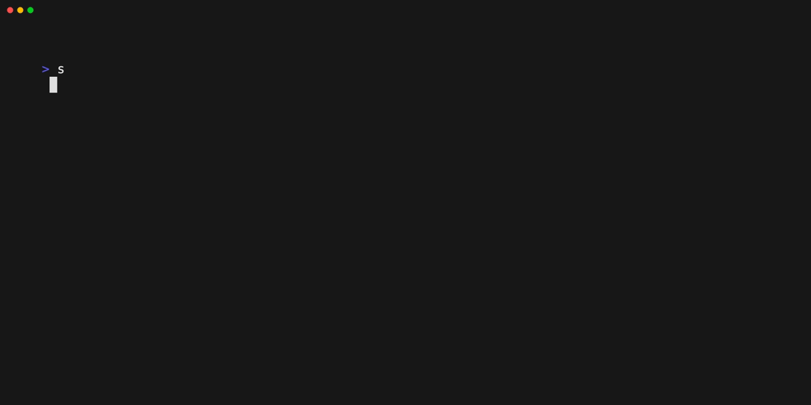

# About



Spotitube is a CLI application to authenticate to Spotify account, fetch music collections — such as account library, playlists, albums or specific tracks —, look them up on a defined set of providers — such as YouTube —, download them and inflate the downloaded assets with metadata collected from Spotify, further enriched with lyrics.

## Usage

By default, Spotitube will synchronize user's library:

```bash
spotitube sync
```

In order to synchronize further set of tracks, use the dedicated flags:

```bash
spotitube sync --playlist spotitube-sync \
    --album https://open.spotify.com/album/6Jx4cGhWHewTcfKDJKguBQ?si=426ac1fd0fbe4cab \
    --playlist-tracks 5s9gvhZDtfTaM8VMfBtssy \
    --track 6SdAztAqklk1zAmUHhU4N7 \
    --fix /path/to/already/downloaded/track.mp3
```

As showed in the previous example, there are several ways to indicate the ID of a resource — be it a playlist, album or track:
regardless Spotitube is given a full URL to that resource (e.g. `https://open.spotify.com/playlist/2wyZKlaKzPEUurb6KshAwQ?si=426ac1fd0fbe4cab`), a URI (e.g. `spotify:playlist:2wyZKlaKzPEUurb6KshAwQ`) or an ID (e.g. `2wyZKlaKzPEUurb6KshAwQ`), it should be smart enough to solve the effective ID resolution all by itself.

Furthermore, in case of playlist, automatic aliasing of personal playlist names into their ID is applied: this enables passing playlist by name instead of ID in case user wants to synchronize personal playlists.

By default, Spotitube uses XDG Base/User Directory Specification to resolve user's Music folder (which usually maps to `~/Music`), but it can be obviously overridden using a dedicated flag:

```bash
spotitube sync -o ~/MyMusic
```

Further auxiliary subcommands are defined and accessible via:

```bash
spotitube --help
```

### Docker

In order to make Spotitube work via Docker, it has to expose its dedicated port (i.e. 65535) and mount both the cache and the music directories as volumes:

```bash
docker run -it --rm \
    -p 65535:65535/tcp \
    -v ~/.cache:/cache \
    -v ~/Music:/data \
    ghcr.io/streambinder/spotitube --help
```

### Headless

The only real issue to be addressed when working with Spotitube running in headless mode, is the redirect during Spotify authentication.

By default, once authenticated to Spotify via web, Spotify itself redirects to a predefined callback URL, which corresponds to http://localhost:65535.
In order to make that redirect go against a custom server, on Spotitube Spotify app, a further callback URL has been defined, i.e. http://spotitube.local:65535.
This is the one that is set as callback at runtime when Spotitube goes through authentication with the `--remote` flag.

So, assuming the server on which Spotitube is running is reachable at 1.2.3.4, make sure the client can correctly resolve `spotitube.local` as 1.2.3.4.

Then, let's authenticate on the server, running the following command:

```bash
spotitube auth --remote
```

This should show a URL to be reached using your client's browser and which, on successful authentication, will hand further doing over to Spotitube on the server on which is running.

Once there, Spotitube can be used normally on the server.
